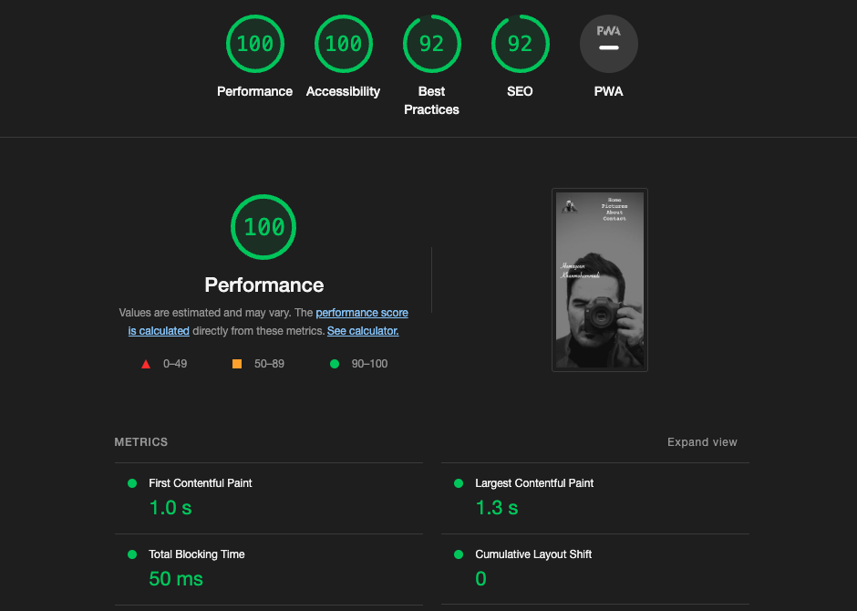
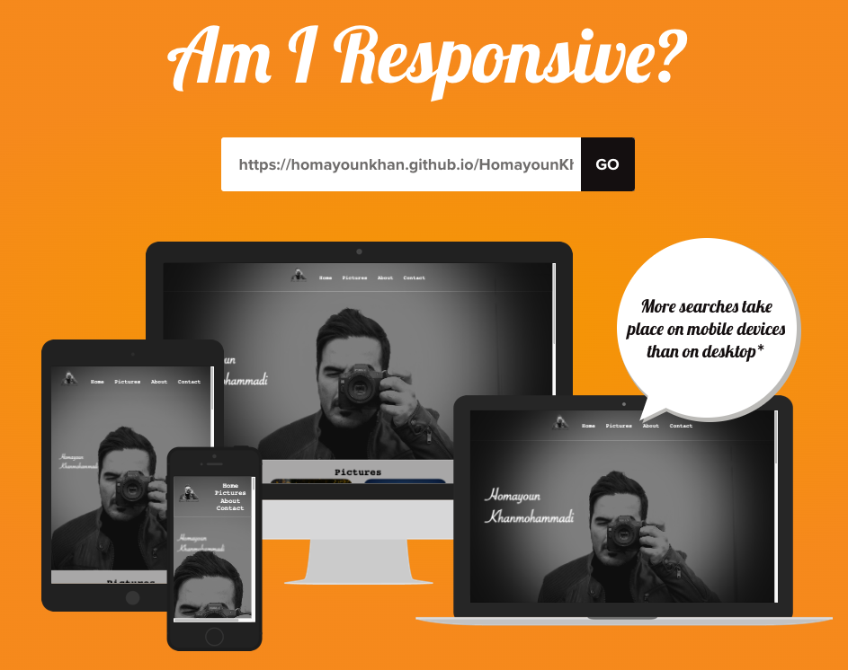

# HKH PICTURES

This is a responsive website showcasing the photography portfolio of Homayoun Khanmohammadi. The website contains sections for the header, about us, and contact.

## Features

- **Responsive Design:** The website is built with responsive design principles, ensuring optimal viewing experience across different devices and screen sizes.

## Sections

1. **The Header:** The website features a navigation bar at the top, providing easy navigation to different sections of the website.

2. **About Us:** The "About Us" section provides detailed information about Homayoun Khanmohammadi, his background, and his passion for photography.

3. **Sign Up Form:** The website includes a sign-up form where visitors can enter their information to receive updates, newsletters, or exclusive offers.

4. **Contact:** The "Contact" section allows users to get in touch with the photographer by filling out a contact form. The form includes fields for name, email, and message.

## Testing

The website has been tested with the following web browsers:
- Chrome
- Safari
- Firefox

## Known Bugs

- There are no known bugs at the moment.

## Validator Testing

The HTML and CSS code of the website have been validated using the W3C validator. The code complies with the recommended standards and does not produce any errors or warnings.

## Note
All photos were taken by Homayoun Khanmohammadi. And I reserve the copyright of all photos.

## License 
All rights reserved by Homayoun Khanmohammadi.
